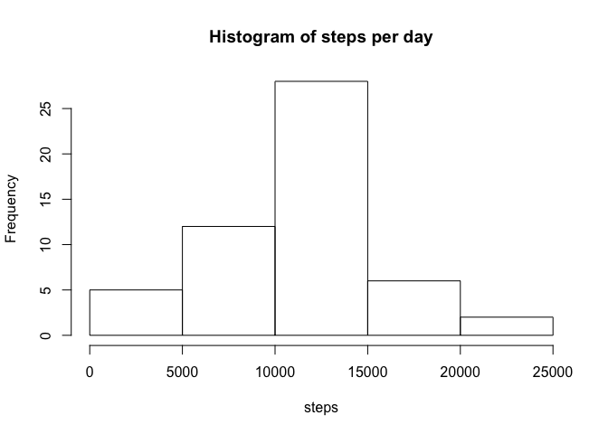
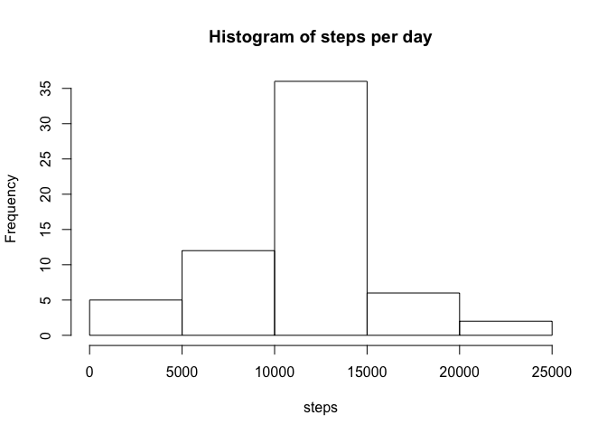
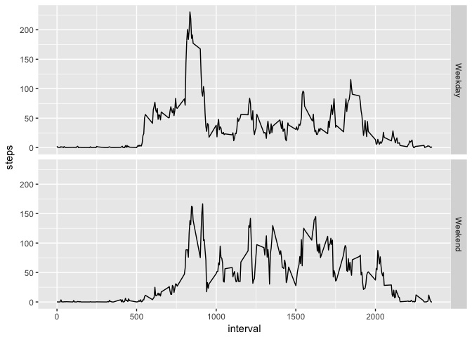

## Loading and preprocessing the data


```r
activityData <- read.csv("activity.csv")
validData <- activityData[!is.na(activityData$steps), ]
```


## What is mean total number of steps taken per day?
* the mean of total number of steps taken per day

```r
stepsPerDay <- aggregate(steps ~ date, data = validData, FUN = sum)
stepsPerDay
```

```
##          date steps
## 1  2012-10-02   126
## 2  2012-10-03 11352
## 3  2012-10-04 12116
## 4  2012-10-05 13294
## 5  2012-10-06 15420
## 6  2012-10-07 11015
## 7  2012-10-09 12811
## 8  2012-10-10  9900
## 9  2012-10-11 10304
## 10 2012-10-12 17382
## 11 2012-10-13 12426
## 12 2012-10-14 15098
## 13 2012-10-15 10139
## 14 2012-10-16 15084
## 15 2012-10-17 13452
## 16 2012-10-18 10056
## 17 2012-10-19 11829
## 18 2012-10-20 10395
## 19 2012-10-21  8821
## 20 2012-10-22 13460
## 21 2012-10-23  8918
## 22 2012-10-24  8355
## 23 2012-10-25  2492
## 24 2012-10-26  6778
## 25 2012-10-27 10119
## 26 2012-10-28 11458
## 27 2012-10-29  5018
## 28 2012-10-30  9819
## 29 2012-10-31 15414
## 30 2012-11-02 10600
## 31 2012-11-03 10571
## 32 2012-11-05 10439
## 33 2012-11-06  8334
## 34 2012-11-07 12883
## 35 2012-11-08  3219
## 36 2012-11-11 12608
## 37 2012-11-12 10765
## 38 2012-11-13  7336
## 39 2012-11-15    41
## 40 2012-11-16  5441
## 41 2012-11-17 14339
## 42 2012-11-18 15110
## 43 2012-11-19  8841
## 44 2012-11-20  4472
## 45 2012-11-21 12787
## 46 2012-11-22 20427
## 47 2012-11-23 21194
## 48 2012-11-24 14478
## 49 2012-11-25 11834
## 50 2012-11-26 11162
## 51 2012-11-27 13646
## 52 2012-11-28 10183
## 53 2012-11-29  7047
```

* Histogram of steps per day

```r
hist(stepsPerDay$steps, main = "Histogram of steps per day",
     xlab = "steps")
```

<!-- -->

* Mean number of steps per day

```r
mean(stepsPerDay$steps)
```

```
## [1] 10766.19
```

* Median number of steps per day

```r
median(stepsPerDay$steps)
```

```
## [1] 10765
```
## What is the average daily activity pattern?
* Time series plot of the 5-minute interval (x-axis) and the average number of steps taken, averaged across all days (y-axis)
* Which 5-minute interval, on average across all the days in the dataset, contains the maximum number of steps?


```r
stepsByInterval <-  aggregate(steps ~ interval,
    data = validData, FUN = mean)
plot(stepsByInterval, type = "l")
```

<!-- -->

```r
stepsByInterval$interval[which.max(stepsByInterval$steps)]
```

```
## [1] 835
```

## Imputing missing values
* The total number of missing values in the dataset

```r
sum(is.na(activityData))
```

```
## [1] 2304
```
* Some data elements in steps field are NA. To fill use the mean numbe of steps from other days in the same interval
* Create a new dataset that is equal to the original dataset but with the missing data filled in.


```r
imputedData <- activityData
naSteps <- activityData[is.na(activityData$steps), ]
imputedData$steps[is.na(imputedData$steps)] <- 
    round(stepsByInterval$steps[match(naSteps$interval,
                                      stepsByInterval$interval)])
```

* Histogram of the total number of steps taken each day and Calculate and report the mean and median total number of steps taken per day. 

```r
stepsPerDay <- aggregate(steps ~ date, data = imputedData, FUN = sum)
hist(stepsPerDay$steps, main = "Histogram of steps per day",
     xlab = "steps")
```

<!-- -->

```r
mean(stepsPerDay$steps)
```

```
## [1] 10765.64
```

```r
median(stepsPerDay$steps)
```

```
## [1] 10762
```
* Do these values differ from the estimates from the first part of the assignment? What is the impact of imputing missing data on the estimates of the total daily number of steps?
- The values differ from the first part by small amounts
- Since we used average, it does not impact if the whole day does not have data, but if a day has partial data, it could be impacted.

## Are there differences in activity patterns between weekdays and weekends?
* Create a new factor variable in the dataset with two levels – “weekday” and “weekend” indicating whether a given date is a weekday or weekend day.

```r
isWeekend <- weekdays(as.Date(imputedData$date)) %in%
  c("Saturday", "Sunday")
imputedData$day <- factor(isWeekend, labels = c("Weekday", "Weekend"))
avgSteps <- with(imputedData, aggregate(steps ~ day + interval,
                                        FUN = mean))
```
* Make a panel plot containing a time series plot of the 5-minute interval (x-axis) and the average number of steps taken, averaged across all weekday days or weekend days (y-axis).

```r
library(ggplot2)
qplot(interval, steps, data = avgSteps, facets = day ~ .,
      geom = "line")
```

<!-- -->
